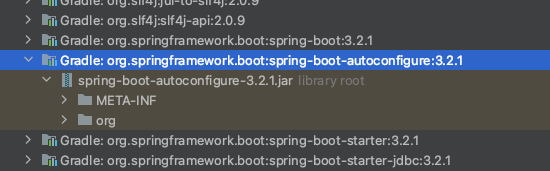

## Spring Boot Auto Configuration - 자동 구성
- 스프링부트는 자동 구성 기능을 제공. 일반적으로 자주 사용하는 수많은 빈들을 자동으로 등록해주는 기능
- 반복적이고 복잡한 빈 등록과 설정을 최소화하고 애플리케이션 개발을 빠르게 시작할 수 있게 해준다.
- spring-boot-autoconfigure 라이브러리를 통해 자동 구성이 이루어짐
  - 
  - 해당 라이브러리 안에 @AutoConfiguration 가 붙은 수많은 클래스가 존재하며 해당 클래스의 빈을 자동으로 등록해준다.

### @Conditional
- 특정 상황일 때에만 특정 빈들을 등록, 사용하도록 도와주는 기능
  ```java
  // Condition 인터페이스를 구현한 구현 클래스
  @Slf4j
  public class MemoryCondition implements Condition {
    @Override
    public boolean matches(ConditionContext context, AnnotatedTypeMetadata metadata) {
    // -Dmemory=on
    String memory = context.getEnvironment().getProperty("memory");
    log.info("memory = {}", memory);
    return "on".equals(memory);
    }
  }
  
  @Configuration
  //  @Conditional(MemoryCondition.class)     // MemoryCondition 에서 구현한 matches 의 결과가 true 일 때 빈으로 등록됨
  @ConditionalOnProperty(name = "memory", havingValue = "on")     // 시스템설정으로 memory 값이 on 일때 빈으로 등록됨
  public class MemoryConfig {
  
      @Bean
      public MemoryFinder memoryFinder() {
          return new MemoryFinder();
      }
  
      @Bean
      public MemoryController memoryController() {
          return new MemoryController(memoryFinder());
      }
  }
  ```
  - @ConditionalOnClass
    - 지정한 클래스가 있을 때 빈으로 등록
    - 외부 라이브러리에 지정한 클래스가 포함되어 있을 때 빈으로 등록하는 용도로 주로 사용
  - @ConditionalOnMissingClass
    - 지정한 클래스가 없을 때 빈으로 등록
    - 외부 라이브러리에 지정한 클래스가 포함되어 있지 않을 때 빈으로 등록하는 용도로 주로 사용
  - @ConditionalOnBean
    - 지정한 타입의 빈이 있을 경우에 빈으로 등록
  - @ConditionalOnMissingBean
    - 지정한 타입의 빈이 없을 경우에 빈으로 등록
  - @ConditionalOnProperty
    - 지정한 시스템 설정 값이 조건에 맞는 값일 때 빈으로 등록