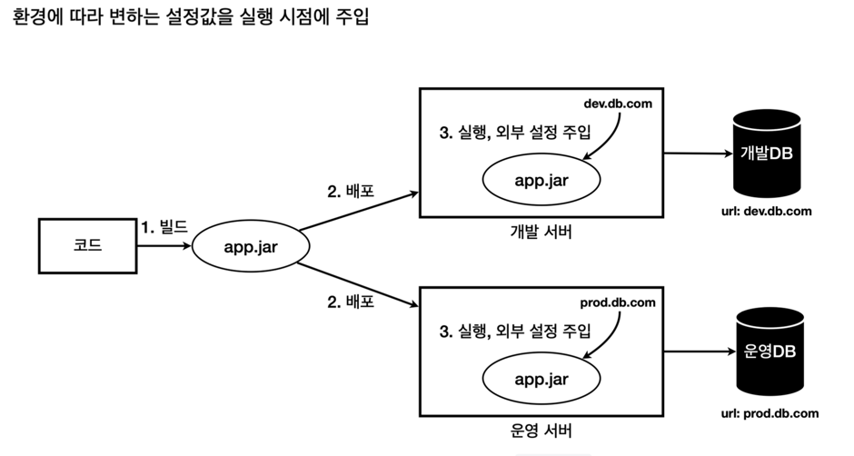

# 외부 설정
- 개발, 운영 등의 환경마다 필요한 값들을 실행시점에 외부로부터 주입
  - 배포 환경에 상관없이 같은 코드를 빌드하고 환경에 필요한 값들을 실행시점에 주입받으므로 소스 관리가 용이해진다.
    

## 외부설정 방법
### 1. OS 환경변수
- OS 에서 지원하는 외부 설정. 해당 OS를 사용하는 모든 프로세스에서 사용할 수 있는 설정

### 2. 자바 시스템 속성
- 자바에서 지원하는 외부 설정. 해당 JVM 안에서 사용
  - JVM 안의 모든 자바 프로그램에서 사용

### 3. 자바 커맨드 라인 인수
- 커맨드 라인에서 전달하는 외부 설정. 실행시 main(arg) 메서드의 파라미터를 통해 사용

### 4. 외부파일
- 프로그램에서 외부 파일을 직접 읽어서 사용